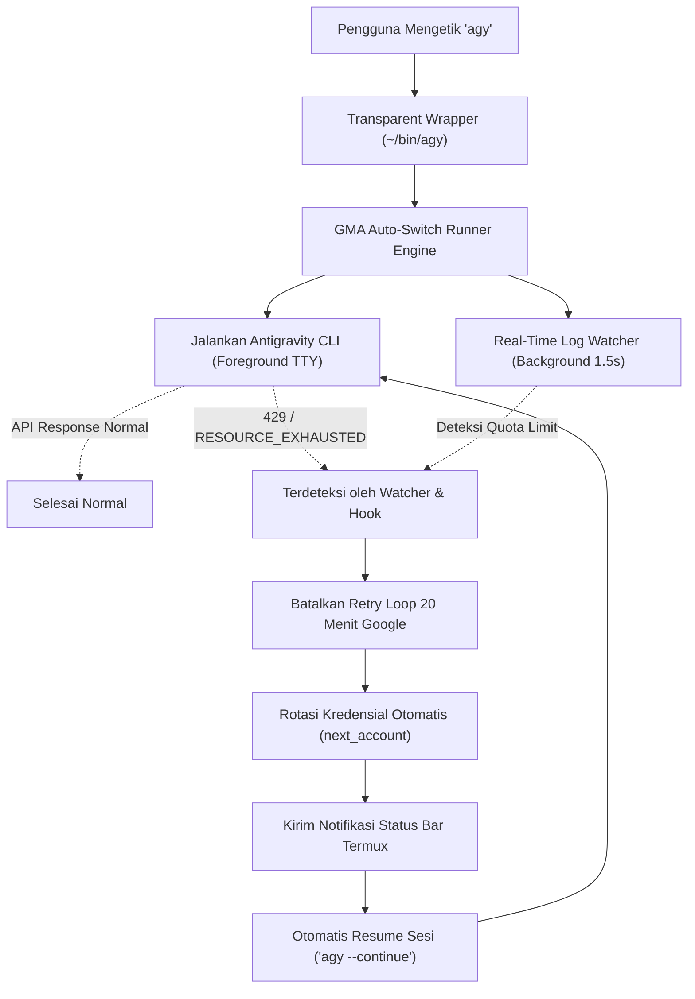

# Panduan Lengkap Multi-Akun & Fitur Auto-Switch GMA (Good Mode AGY)

## 📌 Latar Belakang

Google Antigravity CLI (`agy`) pada dasarnya hanya mendukung satu akun aktif per sesi. Dalam workflow pengembangan intensif, batas kuota model Google (`RESOURCE_EXHAUSTED (code 429)`) sering tercapai. Hal ini biasanya menyebabkan:
- CLI terhenti di tengah tugas panjang atau refactoring besar.
- CLI mencoba perulangan retry hingga 20 menit yang sia-sia karena kuota baru direset berhari-hari kemudian.
- Pengembang terpaksa keluar secara manual dan mengganti kredensial.

**GMA (Good Mode AGY)** hadir untuk memberikan solusi **True Auto-Switching Tanpa Perintah (Zero-Command)** di lingkungan Android (Termux), sehingga sesi CLI Anda dapat berpindah akun secara otomatis seketika saat kuota habis tanpa memerlukan perintah atau konfirmasi manual.

---

## ⚡ Arsitektur True Auto-Switching Tanpa Perintah

GMA menggunakan arsitektur 4 lapis perlindungan (*defense-in-depth*) untuk menjamin auto-switch bekerja secara transparan:



### 1. Transparent Wrapper (`~/bin/agy`)
Ditempatkan di direktori `$HOME/bin/agy` yang memiliki prioritas lebih tinggi di `$PATH`. Pengguna tidak perlu mengetik `gma run` atau perintah lain; setiap panggilan ke `agy` langsung melalui proteksi auto-switch GMA.

### 2. Real-Time Log Watcher
Tails berkas `~/.gemini/antigravity-cli/cli.log` secara berkala (interval 1.5 detik). Saat pola `RESOURCE_EXHAUSTED` atau `Individual quota reached` terdeteksi, watcher langsung menghentikan proses yang sedang menunggu retry backoff dan memicu pergantian akun.

### 3. Zero-Prompt Continuation
GMA tidak lagi menanyakan `Apakah Anda ingin beralih akun? [Y/n]`. Begitu limit terdeteksi:
- Profil aktif diganti ke akun berikutnya yang bertanda rotate (`auto_rotate: true`).
- Notifikasi Android dikirimkan via Termux API.
- Sesi langsung disambung kembali menggunakan perintah `agy --continue` secara otomatis.

### 4. Background Daemon (`gma daemon`)
Daemon mandiri yang berjalan terus-menerus di latar belakang Termux. Jika `agy` dipanggil dari terminal lain atau skrip eksternal, daemon tetap memantau `cli.log` dan merotasi kredensial.

### 5. Native Antigravity Lifecycle Hook (`hooks.json`)
Dikonfigurasi pada `~/.gemini/config/hooks.json`. Menangani sinyal `Stop` saat Antigravity mengalami error kuota dan mengembalikan respons `decision: "continue"` ke sistem core AGY.

---

## ⚙️ Cara Kerja & Penyimpanan Profil

Setiap akun yang pernah diotentikasi disimpan sebagai profil terisolasi di direktori:
```text
~/.gemini/accounts/<email_sanitized>/
├── oauth-token         # Kredensial OAuth token
├── credentials.json    # Kredensial terenkripsi
├── google_accounts.json
├── settings.json       # Preferensi model AGY
└── meta.json           # Metadata (alias, model default, status auto-rotate, catatan)
```

Ketika terjadi pergantian akun (`gma switch`, `gma next`, atau Auto-Switch otomatis):
1. **Sesi Aktif Disimpan Otomatis**: Kredensial sesi akun aktif saat ini dicadangkan ke foldernya.
2. **Kredensial Target Dipasang**: Berkas token akun tujuan disalin dengan permission aman (`chmod 600`).
3. **Penerapan Konfigurasi Kustom**: Jika akun tujuan memiliki konfigurasi model khusus di `meta.json`, GMA secara instan memperbarui model aktif pada berkas `settings.json`.
4. **Notifikasi Termux Dikirim**: Sinyal pergantian akun dikirimkan ke status bar ponsel.

---

## 🏷️ Konfigurasi Kustom per Akun

Anda dapat menyesuaikan tiap akun agar memiliki identitas dan perilaku khusus:

### 1. Alias / Nama Panggilan
Beri alias singkat seperti `Utama`, `Kerja`, atau `Cadangan`:
```bash
gma config 1 --alias Utama
gma switch Utama
```

### 2. Default Model AI per Akun
Setiap akun dapat diarahkan ke model tertentu secara otomatis saat diaktifkan:
```bash
# Akun 1 menggunakan Gemini 3.8 Flash:
gma config 1 --model "Gemini 3.8 Flash (High)"

# Akun 2 menggunakan Gemini 3.1 Pro:
gma config 2 --model "Gemini 3.1 Pro (High)"
```

### 3. Kontrol Auto-Rotate (Proteksi Akun Khusus)
Jika ada akun pribadi penting yang tidak ingin Anda jadikan cadangan rotasi otomatis saat kuota akun lain habis:
```bash
gma config 1 --rotate off
```
Saat auto-switch berjalan, akun ini akan dilewati dan aman dari kuota habis.

---

## 🛡️ Penggunaan Background Daemon

```bash
# Jalankan daemon pemantau kuota di latar belakang:
gma daemon start

# Cek status dan PID daemon:
gma daemon status

# Lihat log aktivitas pergantian akun:
gma daemon log

# Hentikan daemon:
gma daemon stop
```

---

## 🔔 Notifikasi Android Termux

GMA terintegrasi dengan subsistem notifikasi Android Termux (`termux-notification`).

### Persyaratan:
1. Pasang paket API:
   ```bash
   pkg install termux-api
   ```
2. Pastikan aplikasi Android pendamping **Termux:API** telah terpasang di perangkat Anda.

### Kejadian yang Memicu Notifikasi:
- Terdeteksinya batasan kuota (`429`, `RESOURCE_EXHAUSTED`).
- Pergantian akun otomatis via auto-switch runner atau daemon.
- Pergantian akun manual via `gma switch` atau `gma next`.
- Ekspor / impor profil akun berhasil.
- Pengujian notifikasi (`gma test-notif`).

---

## 🚀 Alur Menambah Akun Baru

Proses penambahan akun di Termux berjalan sepenuhnya di foreground:
```bash
gma add
```
1. Akun aktif saat ini dibackup otomatis.
2. GMA menjalankan otentikasi Google.
3. Buka URL login di peramban (browser) ponsel.
4. Salin kode otorisasi dan tempel di terminal Termux lalu tekan Enter.
5. GMA mendeteksi token baru, menyimpannya ke profil, dan meminta Anda memberikan alias opsional.

---

## 📦 Pencadangan dan Pemulihan (Backup & Restore)

Pindahkan seluruh profil akun ke perangkat baru secara utuh:
```bash
# Ekspor semua profil:
gma export ~/gma-accounts-backup.tar.gz

# Impor ke perangkat baru:
gma import ~/gma-accounts-backup.tar.gz
```
